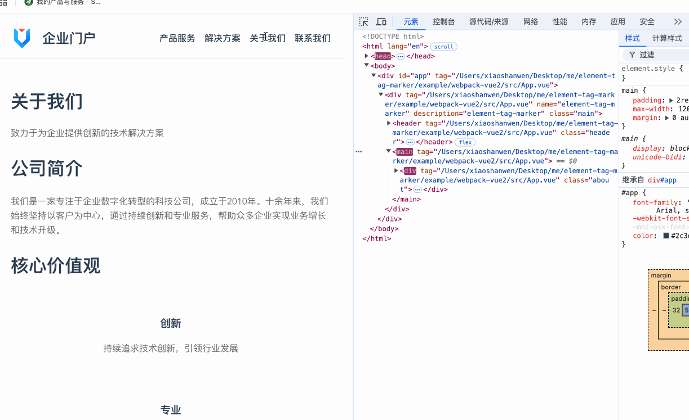

# 🌟 Element Tag Marker

## 🌐 Language

- 🇨🇳 [Chinese](readme_cn.md)
- 🇬🇧 [English](readme.md)

## 📖 Introduction

`Element Tag Marker` is a utility library for adding tags to elements in front-end projects. It supports Vue2/3 and React, and provides Webpack and Vite plugins.

- 🚀 **Supports Multiple Front-end Frameworks**: Vue, React
- 📦 **Supports Main Build Tools**: Webpack, Vite
- 🎨 **Supports Multiple Tag Types**: hash, path, function
- 🔧 **Supports Custom Tag Rules and Filter Rules**
- 📝 **Supports Writing Tags to Source Files**
- ♻️ **Provides Caching Strategy to Optimize Development Experience**

🎯 **Goal**: To provide a simple, efficient, and maintainable tagging solution for front-end developers.

🔗 **GitHub Address**: [https://github.com/wenps/element-tag-marker](https://github.com/wenps/element-tag-marker)

🚀 **Don’t forget to Star us 🌟!**

---

## 🌟 Features

- **Framework Support** 😎: Compatible with Vue2/3 and React.
- **Build Tool Support** 🔧: Compatible with Webpack and Vite.
- **Customizable Tag Generation** 🏷️:
  - Supports generating tags based on hash algorithms or custom functions. Tags can include path parameters and custom parameters.
  - Supports custom tag generation rules, allowing configuration to include or exclude specific paths and tags.
- **Project Tag Differentiation** ✨: Adds project-specific prefixes to tags.
- **Flexible File Handling** 📂: Supports writing tag values to original files for easy tracking.

---

## 📦 Installation

Install the Webpack or Vite plugin via npm:

### Webpack Plugin Installation

Install via npm:

```bash
npm install webpack-element-tag-marker-plugin --save-dev
```

Or use Yarn:

```bash
yarn add webpack-element-tag-marker-plugin --dev
```

### Vite Plugin Installation

Install via npm:

```bash
npm install vite-element-tag-marker-plugin --save-dev
```

Or use Yarn:

```bash
yarn add vite-element-tag-marker-plugin --dev
```

---

## 🛠️ Configuration Examples

### Webpack Configuration (Vue2 Example)

```javascript
const path = require('path');
const { VueLoaderPlugin } = require('vue-loader');
const HtmlWebpackPlugin = require('html-webpack-plugin');
const webpackElementTagMarkerPlugin = require('webpack-element-tag-marker-plugin');

module.exports = {
  entry: './src/main.js',
  output: {
    path: path.resolve(__dirname, 'dist'),
    filename: 'bundle.js',
  },
  resolve: {
    extensions: ['.js', '.vue'],
  },
  module: {
    rules: [
      {
        test: /\.vue$/,
        loader: 'vue-loader'
      },
      {
        test: /\.js$/,
        exclude: /node_modules/,
        use: 'babel-loader'
      },
      {
        test: /\.css$/,
        use: ['vue-style-loader', 'css-loader']
      }
    ]
  },
  plugins: [
    new VueLoaderPlugin(),
    new HtmlWebpackPlugin({
      template: './public/index.html'
    }),
    new webpackElementTagMarkerPlugin({
      tagKey: 'data-tag',
      tagType: 'hash',
      writeToFile: 'hash',
      includePath: ['/src/'],
      excludedPath: ['/node_modules/', '/dist/'],
      toProd: true,
    })
  ],
  devServer: {
    port: 3000,
    hot: true
  }
};
```

### Vite Configuration (Vue3 Example)

```typescript
import path from 'path'
import { defineConfig } from 'vite'
import createVuePlugin from '@vitejs/plugin-vue'
import viteElementTagMarkerPlugin from 'vite-element-tag-marker-plugin'

const vuePlugin = createVuePlugin({
  include: [/\.vue$/],
  template: {
    compilerOptions: {
      hoistStatic: false,
      cacheHandlers: false
    }
  }
})

export default defineConfig({
  plugins: [vuePlugin, viteElementTagMarkerPlugin({
    tagKey: 'data-tag',
    tagType: 'function',
    tagFunction: (path, _tag, option) => {
      return [['hash', option.hashFunction(path)], ['path', path]]
    },
    writeToFile: 'hash',
    includePath: ['/src/'],
    excludedPath: ['/node_modules/', '/dist/'],
    toProd: true,
  })]
})
```

---

## ⚙️ Mechanism

- **Parsing and Processing**: This plugin uses Babel to process the parsed code of each front-end framework to implement new features. By observing the compiled code, attributes can be added at the right place to achieve tag functionality. This applies to both Vue2/3 and React projects built with Webpack and Vite.
  
- **Using WriteToFile**: You can write the current file's tag into the original file. By searching for tags within the project, you can quickly locate the corresponding file (the primary purpose of this plugin).

- **Caching**: The plugin maintains a code mapping table. When the file is unchanged, it directly reads the cache to enhance the development experience.

---

## 📋 Notes

- **Vue3 Developer Tips**: In Vue3, optimizations may skip static node compilation. Currently, the plugin only processes JavaScript, so you need to force the compilation.
  
- **React Support**: React support might not be fully mature as I have limited experience with React projects. If you encounter any issues, feel free to raise questions.

- **Environment Detection**: The Vite plugin detects production mode with `process.env.NODE_ENV === "production"`, and the Webpack plugin does it with `compiler.options.mode === "production"`. Ensure that the production mode detection of your current project is aligned, as this will affect the `toProd` property.

---

## 📚 Examples

### **Vue2 Vite Example**

  

  This example is configured with hash tags. The default value of the tag is the hash generated from the filename of the current code.

### **Vue3 Vite Example**

  

  This example is configured with function tags. The custom function is implemented as follows:
  ```javascript
  tagFunction: (path, _tag, option) => {
      return [['hash', option.hashFunction(path)], ['path', path]]
  }
  ```
  Thus, both path and hash tags exist simultaneously.

### **React Webpack Example**

  

  This example is configured with hash tags. The default value of the tag is the hash generated from the filename of the current code.

### **Vue2 Webpack Example**

  

  This example is configured with path tags. The default value of the tag is the actual path of the current file.

---

Welcome to use and provide feedback! If you have any questions or suggestions, feel free to submit an Issue or Pull Request! 😊✨

Don’t forget to 🌟 Star us on GitHub!