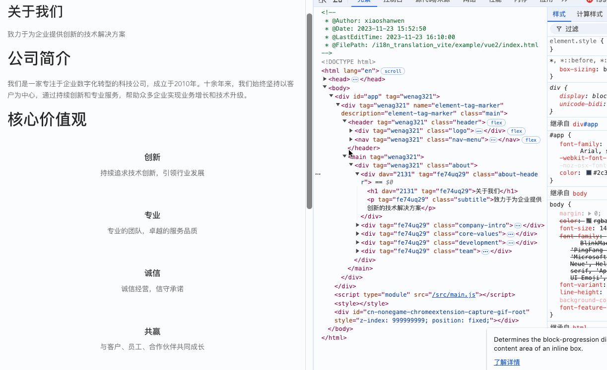

# 🌟 Element Tag Marker

## 🌐 语言

- 🇨🇳 [中文](readme_cn.md)
- 🇬🇧 [英文](readme.md)

## 📖 简介

`Element Tag Marker` 是一个用于为前端项目中的元素添加标记的工具库。支持 Vue2/3、React，并提供 Webpack 和 Vite 插件。

- 🚀 **支持多种前端框架**（Vue、React）
- 📦 **支持主流构建工具**（Webpack、Vite）
- 🎨 **支持多种标记类型**（hash、path、function）
- 🔧 **支持自定义标记规则和过滤规则**
- 📝 **支持将标记写入源文件**
- ♻️ **提供缓存策略，优化开发体验**

🎯 **目标**：为前端开发人员提供一种简单、高效、可维护的标记方案。

🔗 **GitHub 地址**：[https://github.com/wenps/element-tag-marker](https://github.com/wenps/element-tag-marker)

🚀 **欢迎点 🌟 Star！**

---

## 🌟 功能

- **支持框架** 😎：兼容 Vue2/3 和 React。
- **构建工具支持** 🔧：适配 Webpack 和 Vite。
- **可自定义标签生成** 🏷️：
  - 支持基于哈希算法或自定义函数生成标签，生成标签时支持传入路径参数以及自定义参数。
  - 支持自定义标签生成规则，允许通过配置包含或排除特定路径及标签。
- **项目标签区分** ✨：为标签添加工程化的独立前缀。
- **灵活的文件处理** 📂：支持将标记值写入原始文件，便于后续跟踪。

---

## 🎯 为什么你需要它？

如果你希望提升开发效率，减少调试和维护的时间浪费，那么 **Element Tag Marker** 就是为你量身定制的解法。

### 想象一下这些场景：

1. **快速定位问题**：  
   项目代码一多，找代码就会变得极为困难。有了标记，可以通过工具将具体元素的标记值反查到代码文件，一秒定位目标代码，不再为翻找代码浪费时间。

2. **清晰的模块维护**：  
   通过给特定模块添加标签，不仅可以标记它的来源，还能告知其他开发人员它适配了哪些环境，例如 "开发模式逻辑" 或 "生产环境核心逻辑"。  
   当代码耦合问题出现时，一眼就能看出模块职责来源，方便快速解耦，减少误操作。  

3. **加速调试流程**：  
   在多人协作的大型项目中，模块调试往往很耗时。有了精准的标记，调试工具输出的数据可以快速关联到具体代码文件和位置，显著提升调试效率，让每次修复问题更快更精准。

---

## 📦 安装

分别通过 npm 安装 Webpack 或 Vite 插件：

### Webpack 插件安装

通过 npm 安装：

```bash
npm install webpack-element-tag-marker-plugin --save-dev
```

或使用 Yarn：

```bash
yarn add webpack-element-tag-marker-plugin --dev
```

### Vite 插件安装

通过 npm 安装：

```bash
npm install vite-element-tag-marker-plugin --save-dev
```

或使用 Yarn：

```bash
yarn add vite-element-tag-marker-plugin --dev
```

---

## 🔢 参数配置
| 参数名称         | 类型                                        | 默认值                   | 必填 | 描述                                                                                                                                          |
|------------------|---------------------------------------------|--------------------------|----------|-----------------------------------------------------------------------------------------------------------------------------------------------|
| `tagType`        | `enum` (`hash` \| `path` \| `function`)     | `hash`           | ✔️       | 标记类型，支持三种类型：`hash`、`path`、`function`。插件会根据标记类型处理标记，生成的值为标签的键值。                                          |
| `tagKey`         | `string`                                   | `'tag'`                  | ✔️       | 标签的键名，用于在文件/元素属性中标识标签。                                                                                                 |
| `excludedPath`   | `(string \| RegExp)[]`                      | `[]`                     | ❌       | 需要排除的文件路径或正则表达式。例如：`node_modules`、`dist` 等。 默认不排除任何文件路径。                                                     |
| `includePath`    | `(string \| RegExp)[]`                      | `[/src\//]`              | ✔️       | 需要包含的文件路径匹配规则，可以为字符串或正则表达式。默认包含 `src` 目录下的所有文件。注意：webpack 插件包含范围需要注意，不能全量放开，如果要操作node_modules中的文件，需要精确不能操作 vue源码包的 打包文件 |
| `includeTag`     | `string[]`                                 | `[]`                     | ❌       | 需要包含的标签列表，留空时表示包含所有标签。                                                                                                 |
| `excludedTag`    | `string[]`                                 | `[]`                     | ❌       | 需要排除的标签列表，优先级高于 `includeTag`。                                                                                                |
| `hashFunction`   | `(path: string) => string`                 | `--`          | ❌       | 用于生成标签值的哈希函数，默认以路径字符串生成哈希值。函数接收路径参数并返回哈希值。                                                         |
| `toProd`         | `boolean`                                  | `false`                  | ❌       | 是否在生产环境中触发功能。                                                                                                                   |
| `writeToFile`    | `false \| hash \| path`                    | `false`                  | ❌       | 是否将标签值写入原文件，仅支持 `hash` 和 `path` 类型。当为 `hash` 或 `path` 时，插件将值转化为对应标识并写入到原文件中。                        |
| `tagPrefix`      | `string`                                   | `''`                     | ❌       | 标签前缀，用于区分不同项目中的标签，仅对 `hash` 和 `path` 两种类型生效。                                                                    |
| `tagFunction`    | `(path: string, elementTag: Record<string, any>, option) => {tag: string, tagValue: string} \| ([tag: string, value: string][])` | `() => [['', '']]` | ❌       | 标签生成函数，结合自身逻辑生成标签，可以返回一个 `{tag, tagValue}` 的对象或标签数组。函数接收文件路径、元素标签 AST 节点和完整配置项作为参数。 |
| `onlyShowWorkSpaceFilePath`      | `boolean`                                                  | `false`                    | ❌       | 是否只展示工作目录下的具体文件路径。                                    |

---

## 🛠️ 配置示例

### Webpack 配置（Vue2 示例）

```javascript
const path = require('path');
const { VueLoaderPlugin } = require('vue-loader');
const HtmlWebpackPlugin = require('html-webpack-plugin');
const webpackElementTagMarkerPlugin = require('webpack-element-tag-marker-plugin');

module.exports = {
  entry: './src/main.js',
  output: {
    path: path.resolve(__dirname, 'dist'),
    filename: 'bundle.js',
  },
  resolve: {
    extensions: ['.js', '.vue'],
  },
  module: {
    rules: [
      {
        test: /\.vue$/,
        loader: 'vue-loader'
      },
      {
        test: /\.js$/,
        exclude: /node_modules/,
        use: 'babel-loader'
      },
      {
        test: /\.css$/,
        use: ['vue-style-loader', 'css-loader']
      }
    ]
  },
  plugins: [
    new VueLoaderPlugin(),
    new HtmlWebpackPlugin({
      template: './public/index.html'
    }),
    new webpackElementTagMarkerPlugin({
      tagKey: 'data-tag',
      tagType: 'hash',
      writeToFile: 'hash',
      includePath: ['/src/'],
      excludedPath: ['/node_modules/', '/dist/'],
      toProd: true,
    })
  ],
  devServer: {
    port: 3000,
    hot: true
  }
};
```

### Vite 配置（Vue3 示例）

```typescript
import path from 'path'
import { defineConfig } from 'vite'
import createVuePlugin from '@vitejs/plugin-vue'
import viteElementTagMarkerPlugin from 'vite-element-tag-marker-plugin'

const vuePlugin = createVuePlugin({
  include: [/\.vue$/],
  template: {
    compilerOptions: {
      hoistStatic: false,
      cacheHandlers: false
    }
  }
})

export default defineConfig({
  plugins: [vuePlugin, viteElementTagMarkerPlugin({
    tagKey: 'data-tag',
    tagType: 'function',
    tagFunction: (path, _tag, option) => {
      return [['hash', option.hashFunction(path)], ['path', path]]
    },
    writeToFile: 'hash',
    includePath: ['/src/'],
    excludedPath: ['/node_modules/', '/dist/'],
    toProd: true,
  })]
})
```

---

## ⚙️ 机制介绍

- **解析与处理**：这个插件是通过 Babel 对各个前端框架解析后的代码进行处理来实现新增功能的。通过观察编译后的源码，可以在合适的位置添加属性以实现标签功能。这对 Vue2/3 和 React 的 Webpack 和 Vite 产物均适用。
  
- **使用 WriteToFile 功能**：可以将当前文件的标签写入原文件。通过在项目中搜索标签来找到对应文件（这也是此插件的初衷，为了在大量复制粘贴的代码中快速找到目标文件）。

- **缓存处理**：插件维护了代码映射表，当文件未改变时直接读取缓存，提高开发体验。

---

## 📋 注意事项

- **Vue3 开发者提示**：在 Vue3 中，开发者优化可能会跳过静态节点编译，而目前插件只处理 JavaScript，因此需要强制编译。
  
- **React 支持**：React 的支持可能还不够完善，因为本人的 React 项目经验较少，遇到问题欢迎提问。

- **环境判断**：Vite 插件在生产模式的判断是 `process.env.NODE_ENV === "production"`，Webpack 在生产模式的判断是 `compiler.options.mode === "production"`。需要注意当前项目中的生产模式判断是否与此一致，这将影响 `toProd` 属性的作用。

---

## 📚 示例
 
### **Vue2 Vite 示例**

  

  当前示例配置了 hash 标识，标签的默认值便是当前代码所处文件名生产的hash

### **Vue3 Vite 示例**

  

  当前示例配置了 function 标识，自定义函数实现如下：
  ```javascript
  tagFunction: (path, _tag, option) => {
      return [['hash', option.hashFunction(path)], ['path', path]]
  }
  ```
  因此 路径标识和hash标识同时存在

### **React Webpack 示例**

  

  当前示例配置了 hash 标识，标签的默认值便是当前代码所处文件名生产的hash

### **Vue2 Webpack 示例**

  

  当前示例配置了 path 标识，标签的默认值便是当前代码所处文件的具体路径

---

欢迎使用和反馈！如果有问题或建议，欢迎提交 Issue 或 Pull Request！😊✨